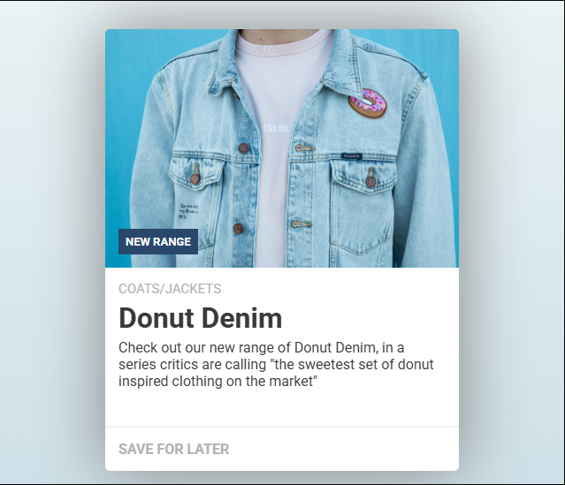

# Card Design

## Referencia:

## O que sera feito?

Usando como base a imagem referencia acima, não existe a necessidade de ser identico. imagem e cores podem ser alteradas

## Tempo:

## Resultado Final:

O "Salve" é o charme
## Considerações:

Tive certa dificuldade em entender como eu iria fazer a organização. mesmo tendo uma base visual foi um pouco complicado vizualizar como ficaria no codigo

Aproveitei para dar uma brincada com o hover, tentei usar parar interarir com um outro elemento, porem isso só seria possivel no elemento filho, para conseguir fazer o que eu tinha em mente teria que começar a usar JavaScript, o que eu não optei no momento
